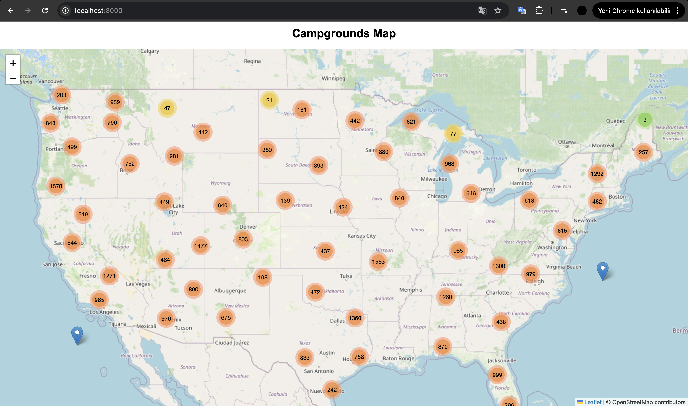
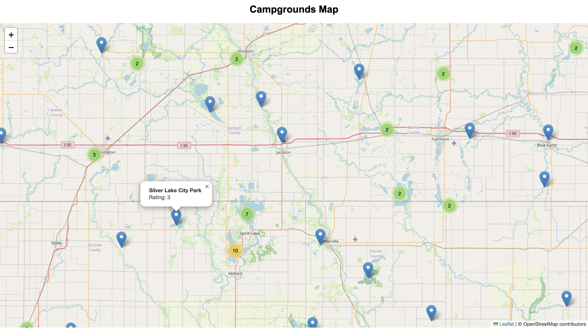

 Web-Scrape Case Study

 ## Overview
Develop a scraper to extract all campground locations across the United States from The Dyrt https://thedyrt.com/search by leveraging their map interface which exposes latitude/longitude data through API requests when the mouse moves. You're free to use any library you want (requests, httpx, selenium, playwright)

* PostgreSQL integration via Docker (fully functional).
* Scrapes all US campground data and saves to the database.
* Data validated using Pydantic models.
* Scheduled scraping every 12 hours using APScheduler.
* Existing records are updated by ID.
* Retry mechanism for failed HTTP requests.
* SQLAlchemy ORM used for DB operations.
* Detailed logging system in place.
* FastAPI endpoints:

  * `/run-async-scraper` → triggers async scraper
  * `/campgrounds-json` → returns JSON data
* Campgrounds are visualized on an interactive map (Leaflet.js + MarkerCluster).
* Async scraping for better performance and speed.

##  Example Screenshots

### 📍 Clustered View

### 🔍 Zoomed-In View

